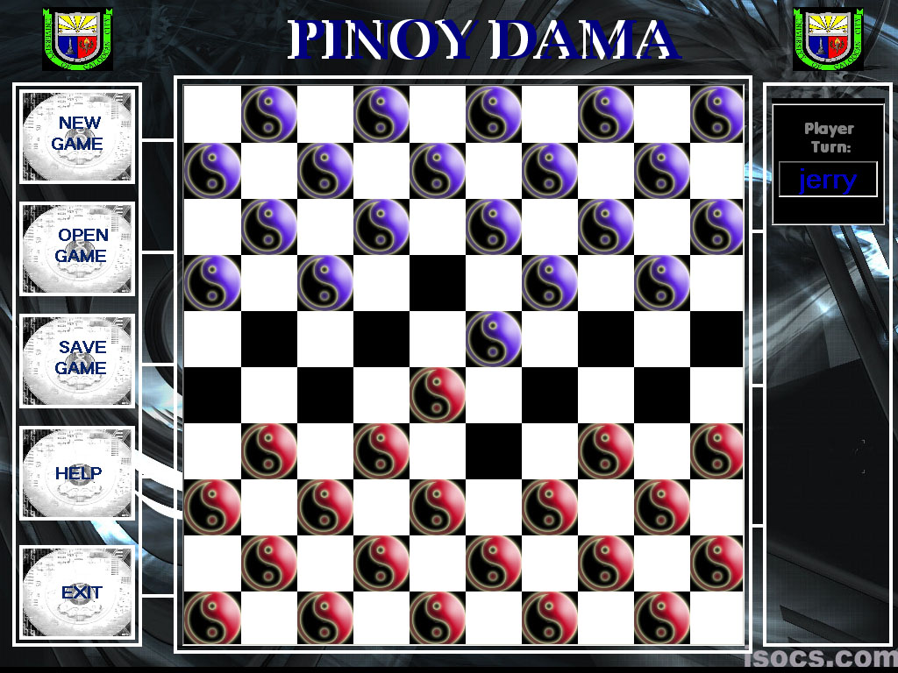



## Pinoy dama UCC version

### Description

To be recognized by the other universities in the philippines, that the students of University of Caloocan City (UCC) have great programmers.
 
### More Info
 

             |
---                |---
**Submitted On**   |2005-03-21 18:14:16
**By**             |[jerry m\. jose ](https://github.com/Planet-Source-Code/PSCIndex/blob/master/ByAuthor/jerry-m-jose.md)
**Level**          |Advanced
**User Rating**    |4.3 (13 globes from 3 users)
**Compatibility**  |VB 6\.0
**Category**       |[Games](https://github.com/Planet-Source-Code/PSCIndex/blob/master/ByCategory/games__1-38.md)
**World**          |[Visual Basic](https://github.com/Planet-Source-Code/PSCIndex/blob/master/ByWorld/visual-basic.md)
**Archive File**   |[jherone1866473222005\.zip](https://github.com/Planet-Source-Code/jerry-m-jose-pinoy-dama-ucc-version__1-59575/archive/master.zip)

